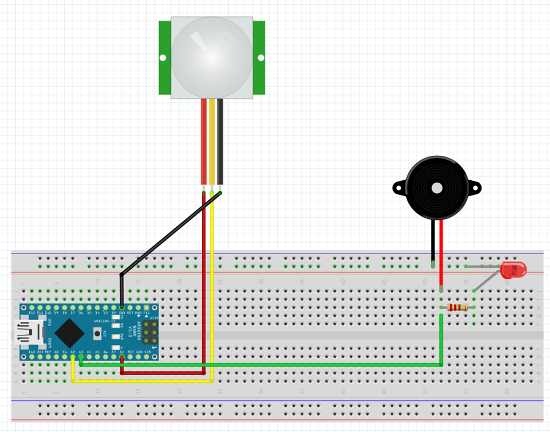
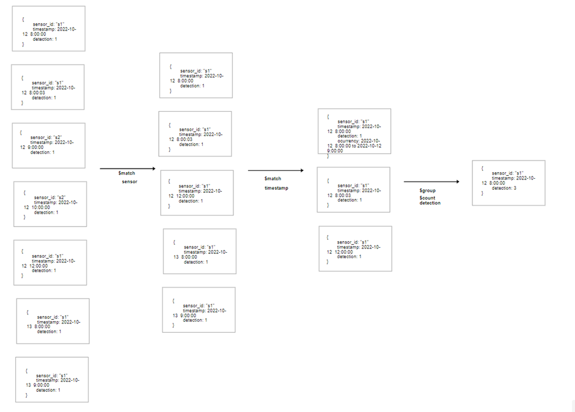

# MotionSensorFinal
# Project Introduction
    It is a new product that can be used in different sitations.
    It can be used in different situations. It can help to improve security, 
    protection, and privacy in users' lives. This is possible since Bip Tech 
    uses a monitor sensor, a light, and a buzzer. It is also possible to see 
    the data afterwards because it is stored in a database.

# Target Audience
    Our product has different targets since security is important for everyone.
    For example, a museum can use this product to prevent a thief from happening,
    a seller can make their store more secure, and people can feel more protected
    in their houses. This product can also help sellesr to know how many people were
    present at a certain time in their store.

# Hardware

# MongoDB Schema Design

# API endpoints

This is a comment from me